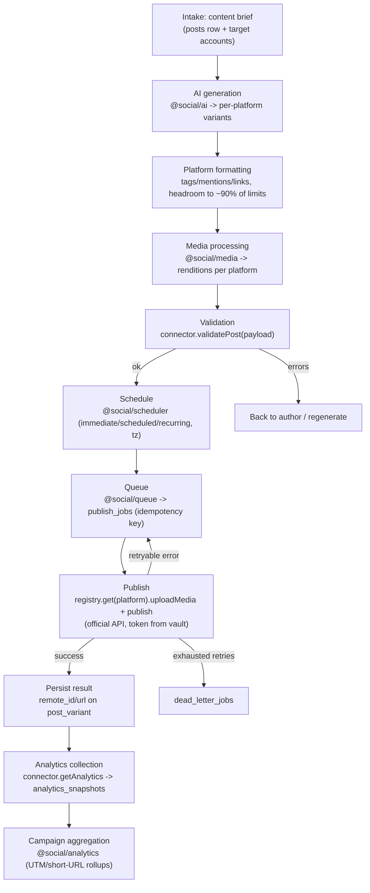

# Architecture — SocialAutomation

Universal Social Distribution & Automation System: author one content brief, let AI generate
platform-optimized variants, validate media and copy, publish through **official platform APIs**
across many accounts, and track analytics — with **new platforms added as plugins, without
touching the core**.

This document is the shared reference for every worker. It defines the module layout, the stack,
and the end-to-end content-pipeline data flow. It is companion to:

- `docs/CONNECTOR-CONTRACT.md` — the `PlatformConnector` plugin contract (source in
  `packages/core/src/`).
- `docs/SCHEMA.md` — the database schema (SQL in `packages/db/migrations/`).

---

## 1. Non-negotiables (apply to every module)

1. **Official platform APIs only.** Connectors talk exclusively to each platform's documented
   public API using the account owner's OAuth credentials. **No scraping, no undocumented
   endpoints, no browser automation** — anywhere, ever. If a feature can't be done via the
   official API, the connector declares it unsupported and reports it; it does not work around it.
2. **Credentials are never plaintext at rest or in logs.** The token vault stores ciphertext plus
   a key *reference* (see `account_tokens` in `docs/SCHEMA.md`). Decryption happens in-memory in
   the auth layer at call time. Loggers redact credential-bearing fields, and callers never place
   raw tokens in log fields.
3. **Every module emits structured log lines.** All logging goes through the `StructuredLogger`
   contract (`@social/core`), never `console.*` directly. Lines are JSON, correlatable by
   `trace_id`, and secret-free.
4. **Validate before publish.** `publish`/`edit` must refuse anything `validatePost` would reject.

---

## 2. Stack

| Concern          | Choice                                | Rationale |
|------------------|---------------------------------------|-----------|
| Runtime          | **Node.js 22 LTS**                    | Current LTS; native `fetch`, `node:test`, stable ESM, `Web Crypto` for the token vault. |
| Language         | **TypeScript 5.5+** (strict)          | The contract-first design leans on the type system; `strict` + `noUncheckedIndexedAccess`. |
| Package manager  | **pnpm workspaces**                   | See below. |
| Module system    | **ESM** (`"type": "module"`)          | Aligns with Node 22 and modern tooling. |
| Database         | **SQLite (dev) / PostgreSQL (prod)**  | Zero-setup local dev; robust prod. Accessed through a thin driver abstraction in `@social/db` so the same portable SQL/migrations run on both (see `docs/SCHEMA.md`). |
| Test runner      | **Vitest**                            | Fast, TS-native, ESM-friendly, built-in mocking for mock platform servers in the conformance suite. |
| Lint / format    | **ESLint + Prettier**                 | ESLint (typescript-eslint) for correctness; Prettier for formatting, so reviews stay about substance. |
| Build            | **tsc project references** (per package) | Incremental, dependency-ordered builds across the workspace. Individual apps (e.g. `api`, `ui`) may add **tsup**/bundler for their deliverable, but library packages ship type-checked `dist`. |

### Why pnpm over npm workspaces

- **Strict, non-hoisted `node_modules`** — a plugin can only import what it declares, which
  matches our "plugins are isolated and swappable" goal and prevents accidental coupling to the
  core's transitive deps.
- **Content-addressed store** — fast, disk-efficient installs across many small packages
  (`packages/*` + one package per platform in `plugins/*`).
- **First-class workspace protocol** (`workspace:*`) for internal deps and `pnpm -r` for
  running a script across every package (typecheck, test, build).

Workspace roots are declared in `pnpm-workspace.yaml` (`packages/*`, `plugins/*`).

---

## 3. Monorepo layout

```
SocialAutomation/
  package.json                 # root scripts, engines (node >=22, pnpm >=9)
  pnpm-workspace.yaml          # workspaces: packages/*, plugins/*
  tsconfig.base.json           # shared strict compiler options
  docs/
    ARCHITECTURE.md            # this file
    CONNECTOR-CONTRACT.md      # PlatformConnector spec
    SCHEMA.md                  # database schema overview
    PLATFORM-RULES.md          # per-platform content rules (owned by content-ai/connector-eng)
    AUTH.md                    # OAuth + vault design (owned by auth-security)
  packages/
    core/                      # @social/core — contract, capabilities, errors, plugin registry types, logging shape
    api/                       # @social/api — internal service/orchestration API the UI and CLI call
    db/                        # @social/db — schema, migrations, driver abstraction (SQLite/Postgres)
    auth/                      # @social/auth — OAuth flows + encrypted token vault + account manager
    logging/                   # @social/logging — StructuredLogger implementation
    queue/                     # @social/queue — persisted job queue, retry/backoff, DLQ
    scheduler/                 # @social/scheduler — immediate/scheduled/recurring, timezones -> enqueues jobs
    media/                     # @social/media — renditions, thumbnails, compression, captions
    ai/                        # @social/ai — content generation: per-platform variants, hashtags, CTAs
    analytics/                 # @social/analytics — snapshot collection + campaign aggregation + URL tracking
    ui/                        # @social/ui — dashboard (accounts, composer, queue, history, analytics)
  plugins/
    discord/                   # @social/plugin-discord — one package per platform connector
    twitch/                    # @social/plugin-twitch
    bluesky/                   # @social/plugin-bluesky
    ...                        # x, reddit, youtube, tiktok, instagram, facebook, linkedin, ...
```

### Package responsibilities & dependency direction

`@social/core` sits at the bottom and depends on nothing internal. **Everything depends inward
on `core`; `core` depends on no one.** Plugins depend only on `core` (for the contract). The core
never imports a plugin — it only receives `PlatformConnector` instances from the plugin registry.

```
core  <──────────────────────────────────────────────┐
  ▲    ▲      ▲       ▲       ▲      ▲      ▲     ▲     │
  │    │      │       │       │      │      │     │     │
logging db  auth  media    ai   queue  analytics │  plugins/*
             ▲     ▲        ▲      ▲       ▲      │
             └─────┴────────┴──────┴───────┴──────┤
                        scheduler ────────────────┤
                                api ──────────────┘
                                 ▲
                                ui
```

- **core** — `PlatformConnector`, `CapabilityDescriptor`, typed errors, `PluginManifest`/registry
  types, `StructuredLogger` shape. No platform code, no DB, no I/O.
- **db** — portable schema + migrations, a driver abstraction (`SqliteDriver`, `PostgresDriver`)
  and typed repositories. Owns the vocabulary in `docs/SCHEMA.md`.
- **auth** — per-platform OAuth orchestration, the encrypted token vault, multi-account CRUD.
  Produces/consumes `TokenSet`; hands connectors a decrypted token via `OperationContext`.
- **logging** — the `StructuredLogger` implementation (JSON lines, redaction, `trace_id`).
- **queue** — persisted `publish_jobs`, worker loop, retry with exponential backoff + jitter,
  dead-letter queue, idempotency keys. Publish-agnostic: it calls a connector via the registry.
- **scheduler** — turns `schedules` (immediate/scheduled/recurring + timezone) into due
  `publish_jobs` for the queue.
- **media** — generates renditions (square/portrait/landscape/story/thumbnail), compresses,
  produces captions; writes `media_assets` + `media_renditions`.
- **ai** — generates platform-tuned variants from one brief (rewrite/shorten/expand, hashtags,
  emojis, CTAs, titles/SEO), targeting the recorded limits in `docs/PLATFORM-RULES.md`.
- **analytics** — collects `AnalyticsSnapshot`s via connectors, aggregates by campaign, manages
  UTM/short-URL/campaign-ID tracking.
- **api** — orchestration surface the UI/CLI use; wires the pipeline stages together.
- **ui** — the dashboard.
- **plugins/\<platform\>** — a connector each, implementing the contract. Standard layout per the
  `connector-scaffold` skill: `src/index.ts` (manifest), `src/connector.ts` (the ten methods),
  `src/capabilities.ts` (declared limits), `test/connector.test.ts` (conformance suite),
  `README.md`.

---

## 4. Plugin model (summary; full spec in CONNECTOR-CONTRACT.md)

- A plugin is a workspace package under `plugins/*` whose `package.json` carries a `socialPlugin`
  field and whose module default-exports a `PluginManifest`.
- The **plugin loader** scans `plugins/*`, imports each manifest, checks its `contractVersion`
  against `CONTRACT_VERSION`, and registers it in a `PluginRegistry` keyed by platform id.
- The core resolves connectors by platform id only (`registry.get('discord')`). Adding a platform
  = adding a `plugins/<platform>` package. No core changes.
- A platform **declares** what it supports via `CapabilityDescriptor`; unsupported operations
  throw `NotSupportedError`. Callers feature-detect via `capabilities.operations.<op>` /
  `supports*` flags.

---

## 5. End-to-end content-pipeline data flow

One `posts.brief` fans out into per-account `post_variants`, each of which is validated, queued,
and published, then measured. Stages are decoupled through the database and the job queue so any
stage can be retried or re-run independently.



### Stage-by-stage inputs and outputs

| Stage | Module(s) | Input | Output | Persisted to |
|-------|-----------|-------|--------|--------------|
| 1. Intake | api, ui | User's single content brief + selected accounts | A `posts` row + target account list | `posts` |
| 2. AI generation | ai | `posts.brief`, target platforms, `PLATFORM-RULES.md` limits | One draft `PostPayload` per account, tuned to each platform | `post_variants` (`payload`, `generated_by='ai'`) |
| 3. Formatting | ai, connector | Draft variant | Finalized copy: hashtags/mentions placed, links + UTM applied, generated to ~90% of hard caps | `post_variants` (`text`, `title`, `payload`) |
| 4. Media processing | media | Uploaded `media_assets` | Per-platform `media_renditions` (square/portrait/landscape/story/thumbnail), compressed, captions | `media_assets`, `media_renditions`, `post_variant_media` |
| 5. Validation | connector (`validatePost`) | Finalized `PostPayload` (+ renditions) | `ValidationResult` (errors/warnings). Errors block; warnings surface to the author | `post_variants` (`validation_state`, `validation_result`) |
| 6. Schedule | scheduler | Validated variant + timing (mode/tz/RRULE) | A due time; creates jobs when due | `schedules` |
| 7. Queue | queue | Due variant | A persisted job with an idempotency key | `publish_jobs` |
| 8. Publish | queue worker + connector (`uploadMedia`, `publish`) | Job + decrypted `TokenSet` (from vault via `OperationContext`) | `PublishResult` (remote id/url). Retryable failures re-queue with backoff; exhausted ones dead-letter | `post_variants` (`remote_id`, `remote_url`, `published_at`), `publish_jobs`, `dead_letter_jobs` |
| 9. Analytics | analytics + connector (`getAnalytics`) | `remote_id` of a published variant | Normalized `AnalyticsSnapshot` (canonical metrics) | `analytics_snapshots` |
| 10. Aggregation | analytics | Snapshots across a campaign | Campaign-level rollups + URL/UTM attribution | (reporting views over `analytics_snapshots`) |

Every stage emits structured log lines carrying the `trace_id` for the pipeline run, plus the
relevant `account_id` / `post_variant_id` / `publish_job_id`, with secrets redacted.

---

## 6. Open items handed to other workers

- **auth-security (t4/t6):** finalize `docs/AUTH.md` — per-platform OAuth flow choices, at-rest
  encryption (algorithm, key management for `encryption_key_ref`), refresh scheduling, and the
  multi-account pairing UX. The vault columns are reserved in `account_tokens`.
- **connector-engineer (t5):** implement `PluginRegistry` + `PluginLoader` against the manifest
  contract in `@social/core`.
- **analytics-logging:** provide the concrete `StructuredLogger` and confirm the canonical metric
  set in `types.ts` covers reporting needs.
- **content-ai / connector-engineer:** author `docs/PLATFORM-RULES.md`; it is the single source
  the AI generator and each connector's `validatePost` both read from.
