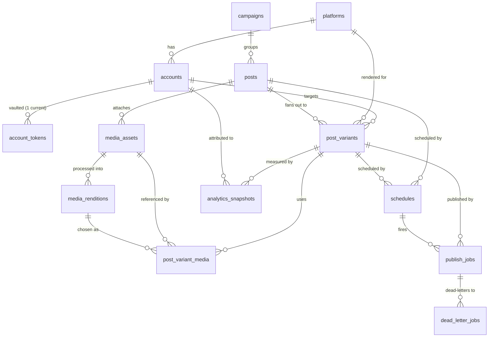

# Database Schema — SocialAutomation

Authoritative DDL: `packages/db/migrations/0001_init.sql`. This document is the ER overview and
table-by-table reference. Table and column names here are the **canonical vocabulary** shared with
the TypeScript types in `@social/core` and every worker.

## Portability (SQLite dev / Postgres prod)

The migration is written to run unchanged on both dialects. Conventions:

- **Primary keys** are application-generated **UUID strings** (`TEXT`) — no `SERIAL`/`AUTOINCREMENT`.
- **Timestamps** are **ISO-8601 UTC strings** in `TEXT` columns, supplied by the app. (Postgres
  deployments may migrate to `TIMESTAMPTZ`.)
- **Booleans** are `INTEGER` `0/1` with `CHECK` constraints (SQLite lacks `BOOLEAN`).
- **JSON** payloads are `TEXT` (marked `-- JSON` in the DDL). Postgres deployments may switch to
  `JSONB`.
- SQLite callers must set `PRAGMA foreign_keys = ON;` per connection.

## Security note (token vault)

`account_tokens` stores **ciphertext + a key reference only** (`encryption_key_ref`), plus AEAD
`nonce`/`auth_tag`. Plaintext access/refresh tokens are **never** stored or logged; decryption
happens in-memory in `@social/auth` at call time. Details in `docs/AUTH.md` (auth-security).

---

## ER overview

The spine of the model: a **campaign** groups **posts**; one **post** (the single brief) fans out
into per-account **post_variants**; each variant is validated, **scheduled**, turned into
**publish_jobs**, published (failures dead-letter), and then measured by **analytics_snapshots**.
Media is a parallel branch: **media_assets** are processed into **media_renditions** and attached
to variants through **post_variant_media**.

---

## Tables

### `platforms`
One row per installed connector plugin. `capabilities` is a cached JSON snapshot of the plugin's
`CapabilityDescriptor` (live source: the plugin's `capabilities.ts`). `enabled` toggles a platform
without uninstalling it.
Key columns: `id` (PK, stable platform id e.g. `discord`), `display_name`, `api_base_url`,
`contract_version`, `capabilities` (JSON), `enabled`.

### `accounts`
Multiple accounts per platform, with profile metadata. `remote_id` is the platform-native account
id; `UNIQUE(platform_id, remote_id)` prevents duplicates. `status` tracks connection health.
FKs: `platform_id → platforms(id)` (cascade delete). Indexes on `platform_id`, `status`.

### `account_tokens` (token vault)
Encrypted OAuth tokens for an account. Stores `access_token_ciphertext`,
`refresh_token_ciphertext` (nullable), `encryption_key_ref`, `encryption_alg`, `nonce`,
`auth_tag`, `token_type`, `scopes` (JSON), `expires_at`, `obtained_at`, `rotated_at`,
`is_current`. Old rows kept as rotation history; a partial unique index
(`uq_account_tokens_current ... WHERE is_current = 1`) enforces exactly one current set per
account. FK `account_id → accounts(id)` (cascade). **No plaintext, ever.**

### `campaigns`
A grouping of posts with shared tracking. `tracking_code` seeds UTM/short-URL/campaign-ID
attribution. `status` in `draft|active|paused|completed|archived`.

### `posts`
The single canonical content brief authored once. `brief` is the source copy; `link_url` is the
canonical (pre-UTM) link. `campaign_id → campaigns(id)` (set null on campaign delete). `status`
tracks lifecycle across all its variants (`draft … partially_published … published`).

### `post_variants`
One platform-optimized rendering of a post, for one account. `payload` is the JSON `PostPayload`
the connector consumes (tags/mentions/thread/platformOptions). `validation_state` +
`validation_result` capture the last `validatePost` outcome. `remote_id`/`remote_url`/
`published_at` are filled after a successful publish. FKs to `posts`, `accounts`, `platforms`
(all cascade). Indexes on `post_id`, `account_id`, `status`.

### `media_assets`
An uploaded original media item (library entry). `media_type` in
`image|video|gif|audio|document`; `checksum` supports dedupe; `storage_uri` locates the original.
Optional `post_id → posts(id)` (set null) so assets can outlive/precede a specific post.

### `media_renditions`
Processed variants of an asset produced by `@social/media`: `kind` in
`original|square|portrait|landscape|story|thumbnail|compressed`, with dimensions/duration/bytes/
bitrate and a `status` progressing `pending → processing → ready`. FK `asset_id → media_assets(id)`
(cascade).

### `post_variant_media`
Join table: which rendition attaches to which variant, in what `position`. `remote_media_id` is
filled after a connector's `uploadMedia` stages the asset. `UNIQUE(post_variant_id, position)`
keeps attachment order stable. FKs to `post_variants` (cascade), `media_assets` (cascade),
`media_renditions` (set null).

### `schedules`
Immediate / scheduled / recurring timing, timezone-aware. `mode` in
`immediate|scheduled|recurring`; `run_at` for one-offs; `timezone` is an IANA zone;
`recurrence_rule` is an RFC 5545 RRULE; `next_run_at`/`last_run_at` drive the scheduler. A
schedule targets a whole `post` (fan out) or a single `post_variant` — a `CHECK` requires at least
one. Index `(status, next_run_at)` for the scheduler's due-scan.

### `publish_jobs`
The persisted work queue. A worker claims eligible rows (`status='pending' AND available_at <=
now`), runs the connector `operation` (`publish|edit|delete`), and updates `status`/`attempts`/
`available_at` (backoff moves `available_at` forward). `idempotency_key` is `UNIQUE` to prevent
double-posting across retries/restarts. `last_error_code` maps to `ConnectorErrorCode`; `result`
holds the JSON `PublishResult`/`EditResult`/`DeleteResult`. Index `(status, available_at)` for the
claim query. FKs to `post_variants` (cascade), `schedules` (set null).

### `dead_letter_jobs`
Jobs that exhausted `max_attempts`, kept for triage/replay. Captures `error_code`/`error_message`,
`attempts`, and a `payload_snapshot`. `resolved`/`resolved_at` track manual disposition. FK
`publish_job_id → publish_jobs(id)` (cascade).

### `analytics_snapshots`
Point-in-time normalized metrics for a published variant. `metrics` is JSON keyed by
`CanonicalMetric` (impressions, reach, likes, comments, shares, clicks, views, saves,
followersDelta, engagementRate); `raw` keeps the untyped platform payload. Campaign aggregation
rolls these up. Index `(post_variant_id, collected_at)`. FKs to `post_variants` (cascade),
`accounts` (set null).

### `logs`
Structured log lines (already secret-redacted at emit time). `level` in `trace|debug|info|warn|
error`, `logger` is the emitting module, `fields` is JSON context, and `trace_id` correlates a
whole pipeline run. Optional soft references `account_id`/`post_variant_id`/`publish_job_id` (not
FK-constrained, so logs survive row deletion). Indexes on `ts`, `level`, `trace_id`. Deployments
may route logs to an external store instead of this table.

---

## Referential-integrity summary

| Child | Parent | On delete |
|-------|--------|-----------|
| accounts | platforms | CASCADE |
| account_tokens | accounts | CASCADE |
| posts | campaigns | SET NULL |
| post_variants | posts / accounts / platforms | CASCADE |
| media_assets | posts | SET NULL |
| media_renditions | media_assets | CASCADE |
| post_variant_media | post_variants / media_assets | CASCADE; media_renditions SET NULL |
| schedules | posts / post_variants | CASCADE |
| publish_jobs | post_variants; schedules | CASCADE; SET NULL |
| dead_letter_jobs | publish_jobs | CASCADE |
| analytics_snapshots | post_variants; accounts | CASCADE; SET NULL |
| logs | (soft refs only) | — |
